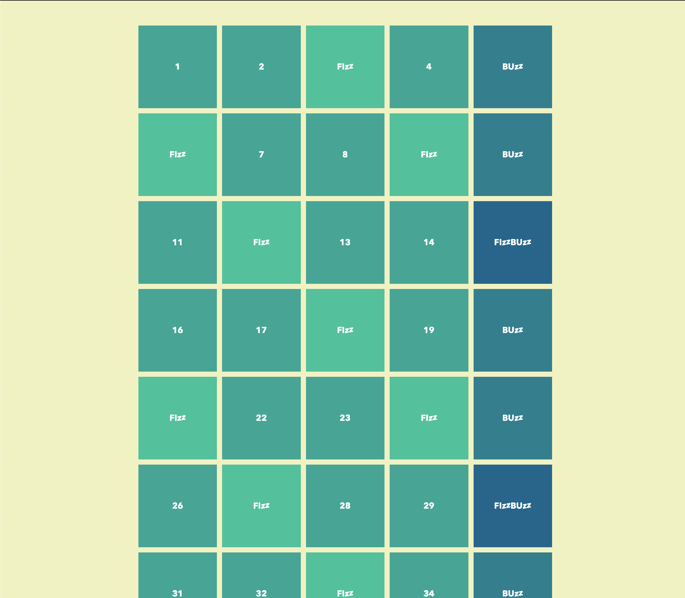

# FizzBuzz
* * *
_FizzBuzz_ est un jeu de mots destiné aux enfants pour leur enseigner la division. Les joueurs se relaient pour compter progressivement, remplaçant tout multiple de trois par le mot _fizz_, les multiples de cinq par le mot _buzz_ et les multiples de 3 et de 5 par le mot _fizzbuzz_.

## Énoncé

Votre mission est d’afficher dans une liste ordonnée tous les nombres entre 1 et 100 avec les exceptions suivantes :

- vous affichez "Fizz" à la place du nombre si celui-ci est divisible par 3 ;
- vous affichez "Buzz" à la place du nombre si celui-ci est divisible par 5 et non par 3 ;
- vous affichez "FizzBuzz" à la place du nombre si celui-ci est divisible à la fois par 3 et par 5.



## Aides

1. Produire une liste ordonnée d’éléments allant de 1 à 100 bornes incluses;

2. Si le nombre est divisible par 3, remplacer sa valeur par la chaine de caractère `FIZZ`;

3. Si le nombre est divisible par 5, remplacer sa valeur par la chaine de caractère `BUZZ`;

4. Si le nombre est divisible par 3 et par 5, remplacer sa valeur par la chaine de caractère `FIZZBUZZ`.

5. Adapter le balisage

    1. Si ce n'est pas un multiple de 3 et/ou de 5 alors il faut produire le noeud HTML suivant

      ```html
      <li>1</li>
      ```

      `1` représente ici la valeur dynamique courante du nombre, `1`,`2`,`4`,etc.

    2. Si c'est un multiple de 3, alors il faut produire le noeud HTML suivant

      ```html
       <li class="fizz">FI<i>zz</i></li>
      ```

    3. Si c'est un multiple de 5, alors il faut produire le noeud HTML suivant  

      ```html
       <li class="buzz">BU<i>zz</i></li>
      ```

    4. Si c'est un multiple de 3 et de 5, alors il faut produire le noeud HTML suivant

      ```html
       <li class="fizzbuzz">FI<i>zz</i>BU<i>zz</i></li>
      ```

## Etapes 

1. Ecrire une boucle qui produit une liste ordonnée d’éléments allant de 1 à 100 bornes incluses;

2. Dans cette boucle :

    - Ecrire une condition qui teste si le nombre est divisible par 3, remplacer sa valeur par la chaine de caractère `FIZZ`;

    - Ecrire une condition qui teste si le nombre est divisible par 5, remplacer sa valeur par la chaine de caractère `BUZZ`;

    - Ecrire une condition qui teste si le nombre est divisible par 3 et par 5, remplacer sa valeur par la chaine de caractère `FIZZBUZZ`.

3. A chaque tour de boucle, afficher le résultat dans la console (`console.log()`)

4. Adapter le balisage dans le fichier `index.html`

    - A chaque tour de boucle, insérer le bon noeud HTML dans la liste ordonnée (propriété `innerHTML` => `+=` ou `insertAdjacentHTML()`)

## Remarques

- Le fichier `exemple.html` contient un exemple du code qui doit être généré.

- Le fichier css `style.css` contient les règles de style à appliquer, il n'est pas nécessaire de le modifier.

- La boucle `for` est la plus adaptée pour ce genre de situation.

- Pour tester si un nombre est divisible par un autre, on utilise l'opérateur modulo `%` qui retourne le reste de la division entière de deux nombres.

  ```js
  3 % 3 // 0
  4 % 3 // 1
  5 % 3 // 2
  6 % 3 // 0
  7 % 3 // 1
  8 % 3 // 2
  9 % 3 // 0
  ```